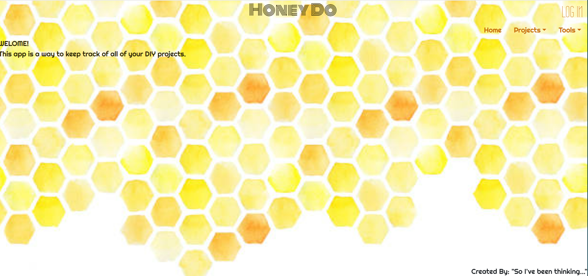
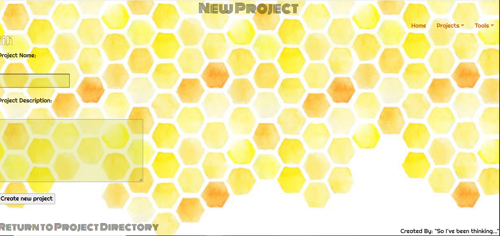
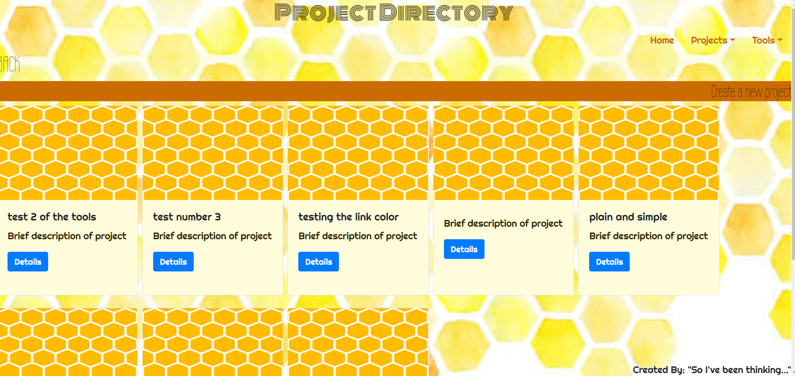

Welcome to my Honey-Do app

**App Screen Shots**

**Links**

Trello:
https://trello.com/b/meYMkVND

Wireframe:
https://app.diagrams.net/#Hwescbro12%2FUnit-2-Honey-Do%2Fmaster%2FUntitled%20Diagram.drawio

**Technologies Used**
JavaScript
Mongoose
React
Node
HTML
CSS

**Getting Started**

**Next Steps**
For future deployment of this app, I would like to be able to have the tools created and selected on the Tools page linked to each individual project.
I would also like to have a progress bar that is associated with a pre-set of standard tasks.
Last but not least, I would like be able to upload pictures to the app so that you can track the progress of your project visually. Who doesn't love a before and after pic?

